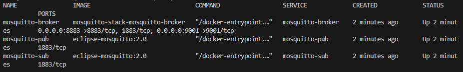

# Mosquitto Stack by Musuyaba

## Table of Contents
* [About The Project](#about-the-project)
* [Requirements](#requirements)

## About The Project
This project included in my portofolio as IoT Engineer, of course what I can use is basic sample for every stack that I use.

## Requirements

## Features
- Authentication user-password
- Encryption user password
- Add user
- Delete user
- Logging Mosquitto Broker
- Securing Connection using OpenSSL
- Example on C++, Python, and Node.js

## Usage
### Docker
1. Build to generate ssl to `./certs/generated`
```shell
docker compose --profile ssl up --build 
```
> Expected Output:
>> ssl  | Certificate request self-signature ok  </br>
 ssl  | subject=C = ID, ST = EastJava, L = MusuyabaHut, O = ServerCertMusuyaba, OU = TestServerCert, CN = mosquitto-broker  </br>
 ssl  | server.crt: OK  </br>
 ssl exited with code 0
2. Running mosquitto-broker, mosquitto-sub, and mosquitto-pub
```shell
docker compose --profile mosquitto up --build
```
> Expected Output:
>> Attaching to mosquitto-broker, mosquitto-pub, mosquitto-sub
3. Open new terminal on the same directory and check container that running
```shell
docker compose ps
```
> Expected Output:
>> 

4. Add user + password from mosquitto-broker container
```shell
docker compose exec mosquitto-broker mosquitto_passwd -b /mosquitto/config/password.txt newUser newUser
```
5. Restart mosuquitto-broker container
```shell
docker restart mosquitto-broker
```
> Expected Output:
>> mosquitto-broker

6. Publish message from terminal 2 using SSL to topics/iot
```shell
docker compose exec mosquitto-pub mosquitto_pub -h mosquitto-broker -t topics/iot -m "Wellcome to Hell as admin" -u admin -P admin --cafile /mosquitto/certs/generated/ca.crt --tls-version tlsv1.2 -d
```
> Expected Output on terminal 1 (as subscriber):
>> mosquitto-sub     | Wellcome to Hell as admin

> Expected Output on terminal 2 (as publisher with debug):
>> Client null sending CONNECT  </br>
Client null received CONNACK (0)  </br>
Client null sending PUBLISH (d0, q0, r0, m1, 'topics/iot', ... (25 bytes))  </br>
Client null sending DISCONNECT

7. Publish message from terminal 2 without ssl to topics/iot2 (**still working** because mosquitto-broker config still open port 1883)
```shell
docker compose exec mosquitto-pub mosquitto_pub -h mosquitto-broker -t topics/iot2 -m "Wellcome to Hell as user" -u user -P user -d
```
> Expected Output on terminal 1 (as subscriber):
>> mosquitto-sub     | Wellcome to Hell as user

> Expected Output on terminal 2 (as publisher with debug):
>> Client null sending CONNECT  </br>
Client null received CONNACK (0)  </br>
Client null sending PUBLISH (d0, q0, r0, m1, 'topics/iot2', ... (24 bytes))  </br>
Client null sending DISCONNECT

8. Publish message from terminal 2 using user newUser to topics/iot3
```shell
docker compose exec mosquitto-pub mosquitto_pub -h mosquitto-broker -t topics/iot3 -m "Wellcome to Hell as newUser" -u newUser -P newUser -d
```
> Expected Output on terminal 1 (as subscriber):
>> mosquitto-sub     | Wellcome to Hell as newUser

> Expected Output on terminal 2 (as publisher with debug):
>> Client null sending CONNECT  </br>
Client null received CONNACK (0)  </br>
Client null sending PUBLISH (d0, q0, r0, m1, 'topics/iot3', ... (27 bytes))  </br>
Client null sending DISCONNECT

9. Remove user 'newUser' and restart mosquitto-broker
```shell
docker compose exec mosquitto-broker mosquitto_passwd -D /mosquitto/config/password.txt newUser && docker restart mosquitto-broker
```
10. Try again to publish message using user 'newUser'
```shell
docker compose exec mosquitto-pub mosquitto_pub -h mosquitto-broker -t topics/iot -m "Wellcome to Hell as newUser" -u newUser -P newUser
```
> Expected Output on terminal 2 (as publisher):
>> Connection error: Connection Refused: not authorised.  <br>
Error: The connection was refused.

11. Press `Ctrl+C` on terminal 1 to shutdown mosquitto-broker, mosquitto-pub, and mosquitto-sub container 
> Expected Output on terminal 1:
>> Aborting on container exit...  </br>
[+] Stopping 3/3  </br>
 ✔ Container mosquitto-pub     Stopped  </br>
 ✔ Container mosquitto-sub     Stopped  </br>
 ✔ Container mosquitto-broker  Stopped  </br>
canceled

## Roadmap
### In Progress
- [ ] CPP Client
- [ ] Node.js Client
- [ ] Python Client

### Done ✓
- [x] Create Readme.md
- [x] Docker for OpenSSL
- [x] Docker for Broker
- [x] Docker for Subscriber
- [x] Docker for Publisher

<!-- LICENSE -->
## License

Distributed under the MIT License. 


<!-- CONTACT -->
## Contact
Please, if you had any hestitate contact me on: 

[Telegram @musuyaba](https://t.me/musuyaba) - m.sulthon.yb@gmail.com


<!-- # Mosquitto - Authentication
## docker compose --profile mosquitto-stack config
## docker compose --profile mosquitto-stack up --build -d
## docker compose logs -f mosquitto-sub
## docker compose exec mosquitto-broker mosquitto_passwd -b /mosquitto/config/password.txt newUser newUser
## docker restart mosquitto-broker
## docker compose exec mosquitto-pub mosquitto_pub -h mosquitto-broker -t topics/iot -m "Wellcome to Hell as admin" -u admin -P admin --cafile /mosquitto/certs/generated/ca.crt --tls-version tlsv1.2 -d
## docker compose exec mosquitto-pub mosquitto_pub -h mosquitto-broker -t topics/iot -m "Wellcome to Hell as user" -u user -P user -d
## docker compose exec mosquitto-pub mosquitto_pub -h mosquitto-broker -t topics/iot -m "Wellcome to Hell as newUser" -u newUser -P newUser -d
## docker compose exec mosquitto-broker mosquitto_passwd -D /mosquitto/config/password.txt user
## docker restart mosquitto-broker
## docker compose exec mosquitto-pub mosquitto_pub -h mosquitto-broker -t topics/iot -m "Wellcome to Hell as user" -u user -P user
## docker compose --profile mosquitto-stack down

RabbitMQ - Telegraf - InfluxDB Grafana
EMQX - Telegraf - InfluxDB Grafana

Kafka
# iot-stack -->
